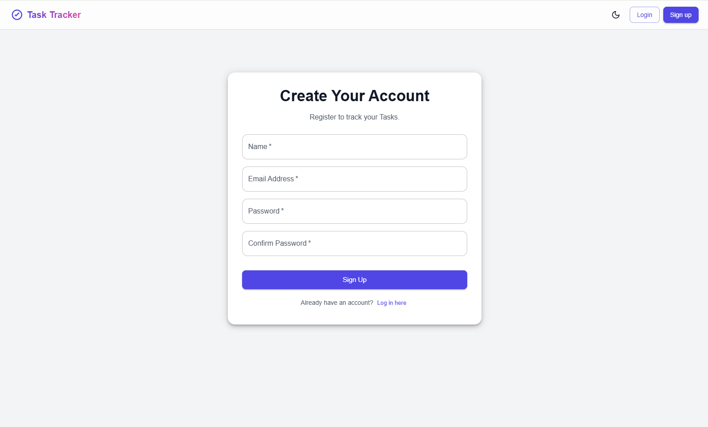

# TaskTracker Application

A MERN stack based web-application designed to manage tasks efficiently.

### Key Features

- Create tasks with description and due date
- Track tasks using three status options: Completed, Pending, and In Progress
- Filter tasks by status
- Quick search through tasks title or description
- Responsive UI for desktop and mobile devices
- Switch between dark and light theme

### Getting Started

#### Client

- Entry Point: `main.jsx`
- Run in Development:
  - Install Libraries: `npm install`
  - Create `.env` file:
    ```bash
    VITE_API_URL=http://localhost:5000/api
    ```
  - Run Application: `npm run dev`

#### Server

- Entry Point: `server.js`
- Run in Development:
  - Install Libraries: `npm install`
  - Create `.env` file:
    ```bash
    PORT=5000
    MONGODB_URI=your_mongodb_uri
    JWT_SECRET=your_jwt_secret
    NODE_ENV=development
    FRONTEND_URL=http://localhost:5173/
    ```
  - Run Application: `nodemon server.js`

### Screenshots

#### Light Theme

- Login Page: 
- Signup Page: 
- Home Page: 

#### Dark Theme

- Login Page: 
- Signup Page: 
- Home Page: 
